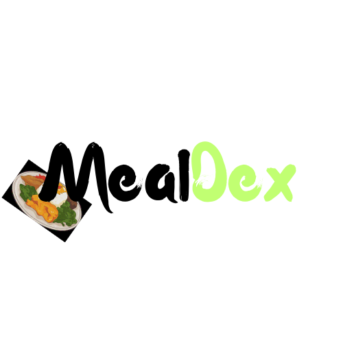

  

# MealDex

The solution to all your dietary needs.

Our team, Coding for 24h, is developing a the web app MealDex to help people with allergies or food restrictions to find suitable menus for them  by providing them with an easy to digest database that is tailored to their needs.

## Team Bios
* Heya, I'm Angelo! I'm looking forward to drinking coffee and coding :D
* Hi! I'm James, I'm 27, like gaming, cooking and hanging out with friends~
* Hey all, Marcy here! This project seems pretty cool.
	
## Technology Used
* HTML, CSS, JavaScript
* Bootstrap 5.0 (Frontend library)
* Firebase 8.0 (BAAS - Backend as a Service)
* Node.js 23.1.0 (runtime environment)
* Express.js 4.21.1 (Node.js web framework)

## Developing MealDex

### Prerequisites

Dolore nulla aliquip cupidatat ex velit velit sunt enim tempor consequat ipsum in irure dolore.

### Cloning the repository

Amet esse eu do cupidatat minim aliquip magna

### Testing

Ea pariatur incididunt cupidatat cupidatat irure consequat ea ea nisi.

## Bugs

(insert issues here)

## Upcoming Features

Laboris est velit adipisicing eiusmod magna. Amet in sunt nostrud pariatur deserunt aliqua aliqua deserunt occaecat consequat. Tempor aute occaecat adipisicing eu consequat quis ex eu eiusmod minim. Aliqua sint Lorem voluptate consequat eu elit pariatur exercitation duis. Et occaecat reprehenderit ullamco tempor elit enim minim. Quis proident pariatur velit ullamco esse magna cillum elit consequat adipisicing excepteur enim magna.

